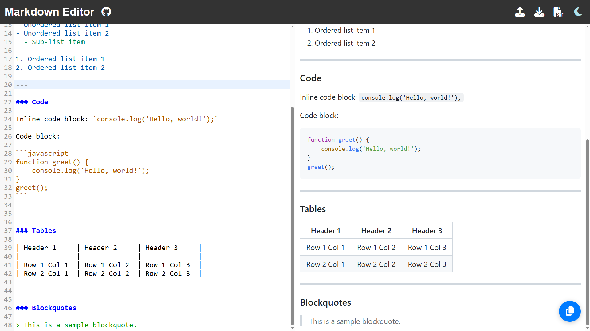

# Markdown Editor

A minimalist and efficient editor for working with Markdown files.

  

## 🚀 Features

- **Real-time preview** of Markdown content.
- **Resizable panels**: Easily adjust the width of the Markdown code and preview panels with a draggable resizer.
- **Load and save** Markdown files.
- **Export to PDF** functionality.
- **Light and dark themes** with preference storage.
- **Auto-save** for content and settings.
- **Improved visual style** for a modern and clean interface.
- **Responsive design**: Optimized for use on both desktop and mobile devices.

## 🛠️ Technologies

This project uses the following technologies and dependencies:

- [CodeMirror](https://codemirror.net/) - Advanced text editor.
- [markdown-it](https://github.com/markdown-it/markdown-it) - Markdown rendering.
- [github-markdown-css](https://github.com/sindresorhus/github-markdown-css) - Markdown styles.
- [highlight.js](https://highlightjs.org/) - Syntax highlighting.
- [Font Awesome](https://fontawesome.com/) - Icons.

## Author

- [Francisco](https://github.com/FrankSkep)

## License

Distributed under the **[GNU AGPL v3.0](https://www.gnu.org/licenses/agpl-3.0.html)**. See the [LICENSE](LICENSE) file for more details.